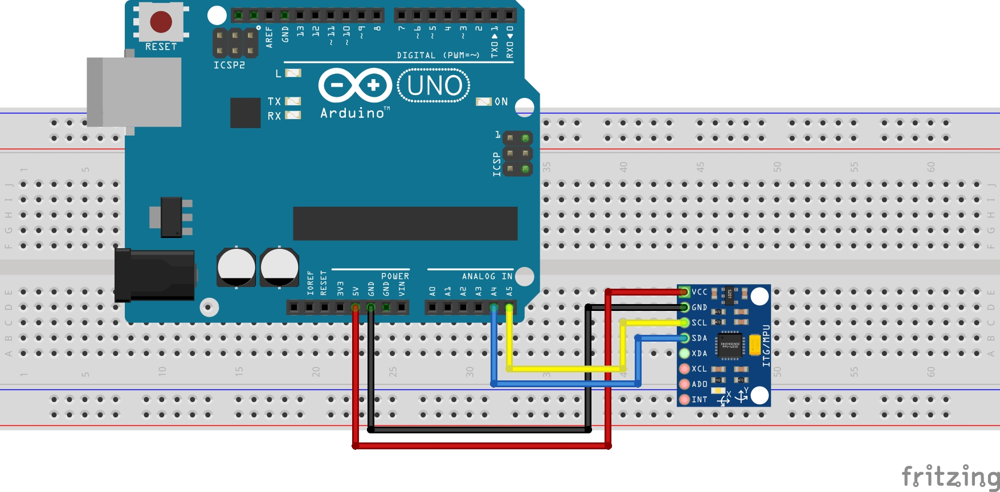

# MPU-6050 Calibration with Arduino
Taking the steps below, you can calibrate your MPU-6050 module.

## Step 1
Wire your MPU-6050 module to an Arduino as shown in the wiring diagram as below.


## Step 2
Run the sketch.

__Note.__ I've used `Clion` + `PlatformIO` as IDE. But using the official Arduino IDE would be ok as well. Just be 
sure to install [this](https://github.com/jrowberg/i2cdevlib/tree/master/Arduino/I2Cdev) and [this](https://github.com/jrowberg/i2cdevlib/tree/master/Arduino/MPU6050) 
library before compiling and uploading the sketch to the Arduino.

## Step 3
After uploading the sketch, You should see output like this:
```
05:37:42.518 -> Send any character to start calibrating...
05:37:44.017 -> 
05:37:44.017 -> calibrating...
05:37:48.212 -> 			ax	ay	az	gx	gy	gz
05:37:48.212 -> 			------------------------------------------------
05:37:48.212 -> average values:		26661	-10291	6367	-292	64	-445
05:37:48.245 -> calibration offsets:	0	0	0	0	0	0
05:37:48.245 -> 
05:37:48.245 -> calibrating...
05:37:52.439 -> 			ax	ay	az	gx	gy	gz
05:37:52.439 -> 			------------------------------------------------
05:37:52.439 -> average values:		-824	2088	17162	95	-18	146
05:37:52.472 -> calibration offsets:	-3332	1286	1252	97	-21	148
05:37:52.472 -> 
05:37:52.472 -> calibrating...
05:37:56.665 -> 			ax	ay	az	gx	gy	gz
05:37:56.665 -> 			------------------------------------------------
05:37:56.726 -> average values:		13	-430	16316	-27	4	-45
05:37:56.726 -> calibration offsets:	-3229	1025	1155	66	-15	100
05:37:56.726 -> 
05:37:56.726 -> calibrating...
05:38:00.894 -> 			ax	ay	az	gx	gy	gz
05:38:00.894 -> 			------------------------------------------------
05:38:00.927 -> average values:		16	86	16387	7	1	14
05:38:00.927 -> calibration offsets:	-3230	1078	1163	75	-16	115
05:38:00.927 -> 
05:38:00.927 -> calibrating...
05:38:05.121 -> 			ax	ay	az	gx	gy	gz
05:38:05.154 -> 			------------------------------------------------
05:38:05.154 -> average values:		-2	-8	16387	-1	1	-1
05:38:05.154 -> calibration offsets:	-3232	1068	1163	73	-16	111
05:38:05.187 -> 
05:38:05.187 -> MPU-6050 is calibrated.
05:38:05.187 -> 
05:38:05.187 -> Use these calibration offsets in your code:
05:38:05.187 -> motionTrackingDevice.setXAccelOffset(-3232);
05:38:05.187 -> motionTrackingDevice.setYAccelOffset(1068);
05:38:05.220 -> motionTrackingDevice.setZAccelOffset(1163);
05:38:05.220 -> motionTrackingDevice.setXGyroOffset(73);
05:38:05.253 -> motionTrackingDevice.setYGyroOffset(-16);
05:38:05.253 -> motionTrackingDevice.setZGyroOffset(111);
```
The sketch should give you calibration offsets in less than a minute. Use those calibration offsets in your main code.